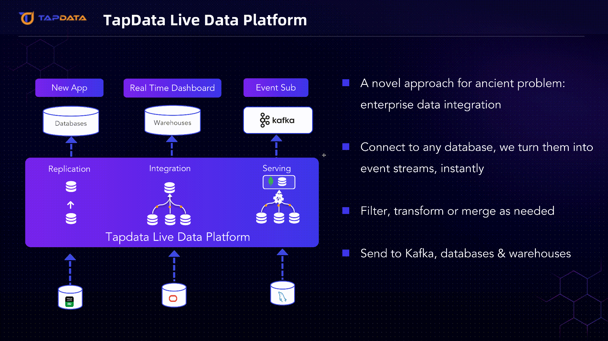

  

---

[?style=for-the-badge>)](https://cloud.tapdata.net)
[?style=for-the-badge>)](https://cloud.tapdata.net)
[?style=for-the-badge>)](https://docs.tapdata.io)

## What is Tapdata ?
Tapdata是一个实时数据集成平台，可以实现数据库、SaaS服务、应用程序、文件等各种系统之间的数据实时同步。

通过拖放操作即可轻松构建同步任务，从建表到全量、增量同步，所有流程完全自动化。

1. [核心功能](https://docs.tapdata.io/cloud/introduction/features)
2. [支持的数据源](https://docs.tapdata.io/cloud/introduction/supported-databases)

欲了解更多详情，请阅读在线文档 [docs](https://docs.tapdata.io/)
 
## 快速开始
### 使用云服务开始体验
Tapdata服务在云服务中可用，您可以使用完全托管的服务，或将引擎部署到您的专用网络

试用 https://cloud.tapdata.io/，支持google和github账户登录，免费试用，无需信用卡，立即开始您的实时数据之旅。

### 使用本地部署开始体验
运行命令 `docker run -d -p 3030:3030 github.com/tapdata/tapdata-opensource:latest`, 等待 3 分钟, 然后即可访问 http://localhost:3030/ 获取服务

默认的用户名是: admin@admin.com, 默认的密码是: admin

## 示例

    
<h4>🗂️ 创建数据源, 并做连接测试</h4>

1. 登录tapdata平台

2. 在左侧导航面板中，单击“连接”

3. 在页面右侧，点击“创建”

4. 在弹出的对话框中，搜索并选择MySQL

5. 在跳转到的页面中，按照以下说明填写MySQL的连接信息

</img>

6. 单击“测试”，确保所有测试通过，然后单击“保存”

</img>

    
<h4>🗂️ 将数据从 MySQL 同步到 MongoDB</h4>

1. 创建MySQL和MongoDB数据源

2. 在左侧导航面板中，单击数据管道 -> 数据复制

3. 在页面右侧，点击“创建”

4. 将 MySQL 和 MongoDB 数据源拖放到画布上

5. 从MySQL数据源拖一行到MongoDB

6. 配置MySQL数据源，选择需要同步的数据表

</img>

7. 单击右上角的“保存”按钮，然后单击“开始”按钮

8. 观察任务页面的指示灯和事件，直至数据同步

</img>

    
<h4>🗂️ 使用简单的 ETL 从 MySQL 到 PostgreSQL</h4>

1. 创建MySQL和PostgreSQL数据源

2. 在左侧导航面板中，单击数据管道 -> 数据转换

3. 在页面右侧，点击“创建”

4. 将 MySQL 和 PostgreSQL 数据源拖放到画布上

5. 从MySQL数据源拖一行到PostgreSQL

6. 单击连接线上的加号并选择“字段重命名”

</img>

7. 单击Field Rename节点，将config表单中的i_price更改为price，i_data更改为data

</img>

8. 单击右上角的“保存”按钮，然后单击“开始”按钮

9. 观察任务页面的指示灯和事件，直至数据同步

</img>

    
<h4>🗂️ 在 MongoDB 中制作物化视图</h4>

物化视图是tapdata的特色功能，您可以充分发挥MongoDB文档数据库的特性，创建您需要的数据模型，尝试享受吧！

在这个例子中，我将使用MySQL中的2个表创建一个视图：订单和产品，将产品作为订单的嵌入文档，步骤如下：

1. 创建MySQL和MongoDB数据源

2. 在左侧导航面板中，单击数据管道 -> 数据转换

3. 在页面右侧，点击“创建”

4. 点击左上角的mysql数据源，然后将订单表和产品表拖放到画布上

5. 将左下侧的“主从合并”节点拖放到画布上

6. 从订单表拖一条线到主从合并

7. 从产品表拖一条线到主从合并

8. 将MongoDB数据源拖放到画布上，并从“主从合并”节点拖一条线到MongoDB节点

</img>

9. 点击“主从合并”节点，然后将产品表拖入“表名”右侧的订单表中

</img>

10. 点击“主从合并”节点，然后点击产品表，配置数据写入模式为“匹配合并”，字段写入路径为“产品”，关联条件为“order_id”=>“order_id”，即可 请参阅底部的架构已更改

11. 点击MongoDB节点，配置目标表名为order_with_product，更新条件字段配置为“order_id”

</img>

12. 单击右上角的“保存”按钮，然后单击“开始”按钮

13. 观察任务页面的指示灯和事件，直至数据同步

14. 检查MongoDB中的集合order_with_product，您将看到数据模型

    
<h4>🗂️ 数据校验检查</h4>

利用数据校验功能，可以快速检查同步数据是否一致、准确

1. 在左侧导航面板中，点击数据管道 -> 数据验证

2. 在页面右侧，点击任务一致性验证

3. 选择1个任务，有效类型选择“所有字段验证”，这意味着系统将检查所有记录的所有字段

</img>

4. 单击“保存”，然后单击任务列表中的“执行”

5. 等待验证任务完成，点击任务列表中的结果，查看验证结果

</img>

## 架构图

## 许可证
Tapdata 项目使用 Apache 2.0 许可证, 请参照 [LICENSE](https://github.com/tapdata/tapdata/blob/main/LICENSE)

## 加入我们
- [发送邮件](mailto:team@tapdata.io)
- [加入 Slack](https://join.slack.com/t/tapdatacommunity/shared_invite/zt-1biraoxpf-NRTsap0YLlAp99PHIVC9eA)
